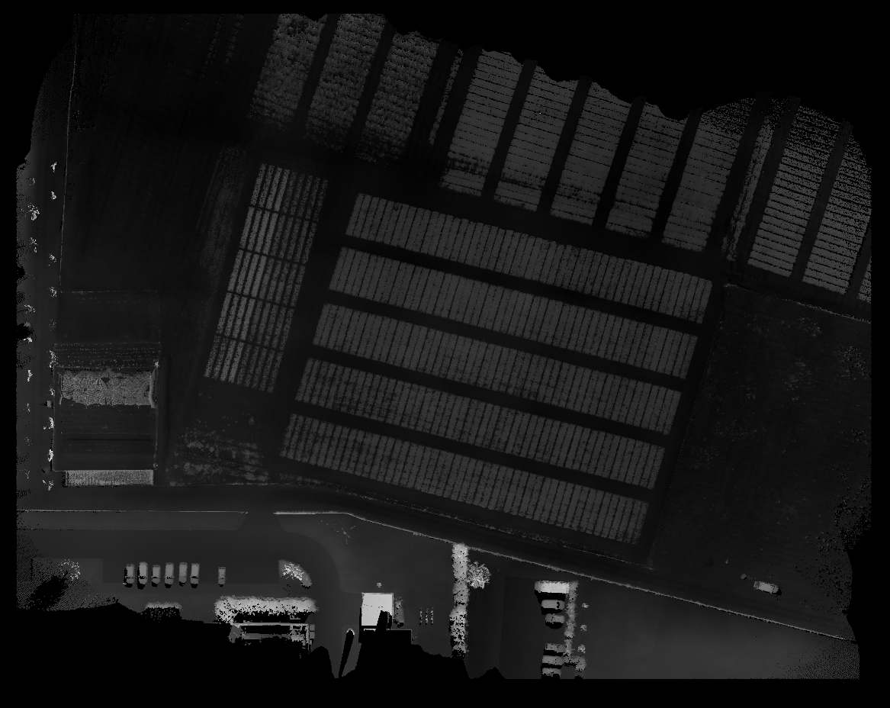
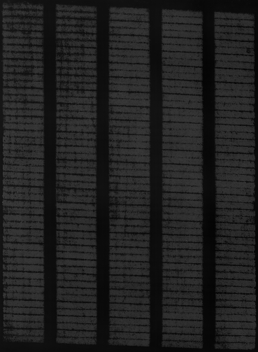

# Alfan
Program with graphical user interface for analyzing and evaluating field heights over time.  

## How it works

Program for each las file in `data` folder:
1. Loads 3D `las` file
2. Removes 3D points with bigger value than 99.9% quantile and lower than 0.1% quantile
3. Subtracts minimal X, Y, Z value and saves that values into `info.json`
4. Normalizes X, Y axes, then scales them by WH_SCALE factor
5. Normalizes Z axis, then scales it to 16bit image
6. Uses **dynamic averaging** - multiple 3D points at the same position in pixel grid are averaged, then 3D point count is visualized in `1_count.png` 


7. Converts 3D data into 2D pixel grid, saves it into `1_original.png`


8. Makes **median** of `1_original.png` that ignores zeroes when calculating median and then every black pixel replaces with median value => maximizes information from just few 3D points. Then saves it into `2_median.png`



9. User rotates image using GUI, so that longer sides of blocks of field are vertical, program saves it into `3_rotated.png`


10. User selects field for analysis from rotated image using GUI, program saves it into `4_cropped.png`



## Structure

### Folders
- `data` - input folder for las files
  - `210420_065626.las` - datetime in filename `YYMMDD_HHMMSS *.las`, e.g.:
  - `210504_064914.las`
  - ...
- `results` - output folder
  - `210420_065626` - match with filename from data without extension 
    - `1_count.png` 
    - `1_original.png`
    - `2_median.png`
    - ...
  - `210504_064914.las`
    - ...
    
### Files

- `main.c` - optimized C script for converting 3D las data to 2D image and computing median 
- `main-part1.py` - Python wrapper for C script
- `main-part2.py` - User GUI for precise field rotation and field selection
- `main-part3.py` - Python script for analysis
- `init.py` - constants + common things

## Install on Debian based Linux:

### Install Python3 and gcc

```bash
sudo apt update
sudo apt install python3 python3-pip build-essential
```

### Install Python packages
```bash
python3 -m pip install -r requirements.txt
```

### Compile main.c

```bash
gcc -shared -o main.so main.c
```

## Run
1. Paste/move your las files into data folder (match folder and file structure)
2. Run `python3 main-part1.py` to generate images
3. Run `python3 main-part2.py`
   1. Rotate image using arrows, so field blocks lines are vertical
   2. Press *enter*
   3. Select upper left corner using *arrows* to crop
   4. Press *enter*
   5. Select bottom right corner using *arrows* to crop
   6. Press *enter*
4. Run `python3 main-part3.py` to create analysis
5. Results are in `results` folder

## Tested on:
- MacOS 12 Python 3.8
- Ubuntu 22.04 Python 3.10


## TODO
- [ ] Optimize for multicore processors
- [ ] Optimize for low RAM computers
- [ ] Object Oriented Programming?