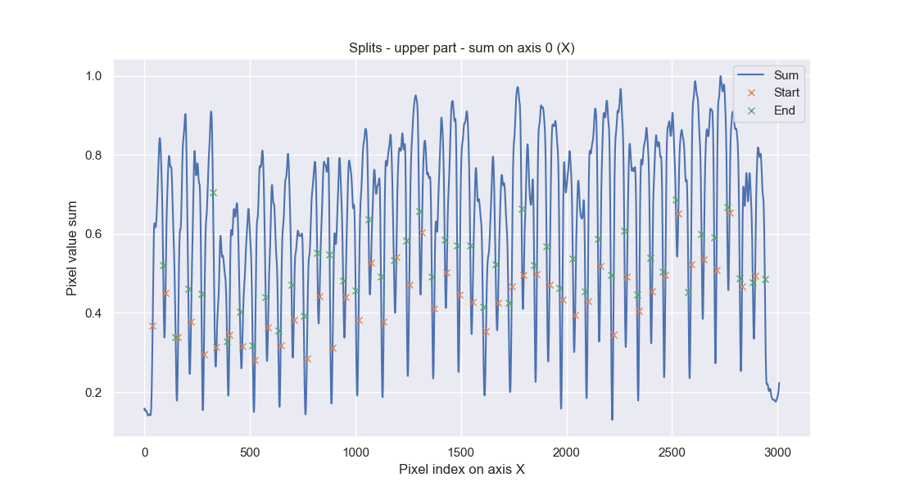
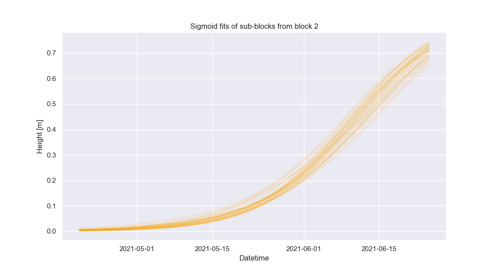
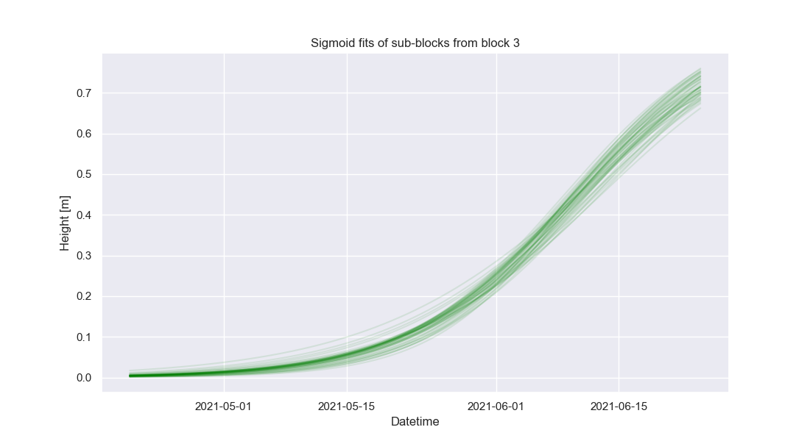
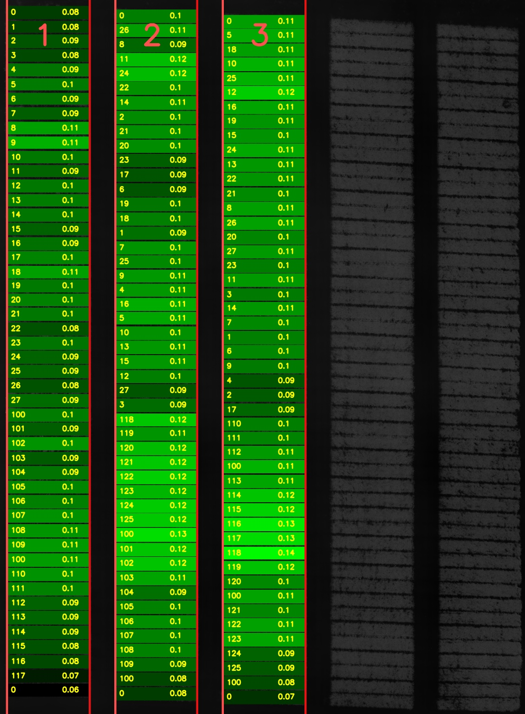
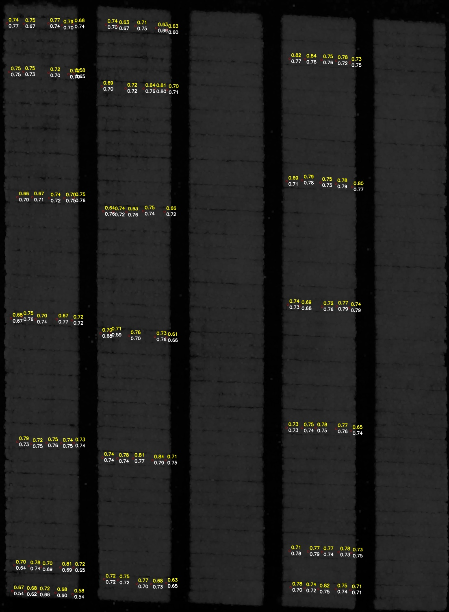

# Alfan
Program with graphical user interface for analyzing and evaluating field heights over time captured by LiDAR on a drone.  

## How it works

In `main-part1.py` program for each `las` file in `data` folder:
1. Loads 3D `las` file
2. Removes 3D points with bigger value than 99.9% quantile and lower than 0.1% quantile
3. Subtracts minimal `X`, `Y`, `Z` value and saves that values into `info.json`
4. Normalizes `X`, `Y` axes, then scales them by `WH_SCALE` factor
5. Normalizes `Z` axis, then scales it to 16bit image
6. Uses **dynamic averaging** - multiple 3D points at the same position in pixel grid are averaged, then 3D point count is visualized in `1_count.png` 


7. Converts 3D data into 2D pixel grid, saves it into `1_original.png`


8. Makes **median** of `1_original.png` that ignores zeroes when calculating median and then every black pixel replaces with median value => maximizes information from just few 3D points. Then saves it into `2_median.png`


In `main-part2.py` then for last image in time series:

1. User rotates image using GUI, so that longer sides of blocks of field are vertical, program saves it into `3_rotated.png`


2. User selects field for analysis from rotated image using GUI, program saves it into `4_cropped.png`


3. Program automatically rotates and crops all other images

In `main-part3.py` program:
1. Sums all images into one image, saves it into `0_sum.png`


2. Sums summed image over vertical axis, applies **log** for better processing, saves it into `blocks_sum.png`


3. Detects starting and ending edges of blocks using first derivative, saves it into `blocks_derivative.png`


4. Separates each block into separate image, saves example output in new folder - e.g. `block_1/0_block.png`


5. Split block into upper and bottom part

For upper and bottom part program:
1. Sums block over vertical axis, applies **log** for better processing, e.g. saves it into `block_1/fit_up_sum.png`



2. Detects starting and ending edges of sub-blocks using first derivative, e.g. saves it into `block_1/fit_up_derivative.png`


Then program puts upper and bottom edge detections together and:

1. Detects deformation

<!--  -->


2. Removes deformation

<!--  -->


3. Applies local maxima filter (with kernel size 1/10 sub-block width)


Finally, for each sub-block program:

1. Subtracts from it the same sub-block from first las file (the earliest record in time series when nothing has grown yet = terrain)

2. Computes:
   - Mean
   - Standard deviation
   - Median
   - Minimum
   - Maximum
   - Quantiles - 1%, 5%, 25%, 75%, 95%, 99%
   - Relative growth rate using formula:
<p align="center">
 
</p>

3. Some keys saves into `statistics.csv`

4. Key enumerating image is saved into `4_cropped_draw.png`


Matlab program fits sigmoid for each growth curve with parameters A, B, C:

<p align="center">
 
</p>

### Visualization of sigmoid of sub-blocks for each block

Visualization of sigmoid of sub-blocks for block 1:


Visualization of sigmoid of sub-blocks for block 2:



Visualization of sigmoid of sub-blocks for block 3:



### Sigmoid parameter visualization

Visualization with treatment ID of parameter A ("maximum crop height"):


Visualization with treatment ID of parameter B ("growth velocity"):



Visualization with treatment ID of parameter C ("growth onset"):


## Validation

### Reference height validation

Reference height validation is important for understanding how much is LiDAR accurate. It is determined by subtracting LiDAR measured height from referenced height measured manually.

#### Error (difference) distribution statistics

| Metric | Value [m] | Value of absolute error [m] |
|--------|-----------|-----------------------------|
| Mean   | 0.0050    | 0.0410                      |
| STD    | 0.0523    | 0.0325                      |
| Median | 0.0062    | 0.0334                      |
| Q25    | -0.0252   | 0.0144                      |
| Q75    | 0.0359    | 0.0579                      |
| Min    | -0.1335   | 0.0020                      |
| Max    | 0.1312    | 0.1335                      |
| RMSD   | 0.0522    | -                           |

#### Error (difference) distribution histogram


#### Error (difference) in image 

Lower white values were measured by LiDAR and upper yellow values were measured manually. 



### Terrain altitude validation over time


Image example:


## Structure

- `calibration` - calibration `las` or `txt` files
- `data` - input folder for `las` files
  - `210420_065626.las` - datetime in filename `YYMMDD_HHMMSS *.las`, e.g.:
  - `210504_064914.las`
  - ...
- `results` - output folder
  - `210420_065626` - match with filename from data without extension 
    - `1_count.png` 
    - `1_original.png`
    - `2_median.png`
    - `3_rotated.png`
    - ...
  - `210504_064914`
    - ...
  - `terrain.png` - fixed terrain height stability over time
  - `terrain_image.png` - visualized fixed cropped terrain
  - `height_diff_histogram.png` - difference between reference and measured heights plotted in histogram
  - `height_diff_image.png` - difference between reference and measured heights plotted in image
  - `statistics.csv` - all output statistics from Python scripts for visualization and evaluation
  - `info.json` - all computed information used internally to share between scripts
- `tools`
  - `compress.py` - Python script to compresses images for documentation
  - `validate_heights.py` - Python script to validate manually measured reference heights with LiDAR heights
  - `validate_terrain.py` - Python script to validate terrain height stability over time
  - `visualize.py` - Python script that visualizes Matlab's sigmoid fit parameters for each sub-block into image
  - `visualize_sigmoid.py` - Python script that visualizes Matlab's sigmoid fits for each sub-block
- `main.c` - optimized C script for converting 3D las data to 2D image and computing median 
- `main-part1.py` - Python wrapper for C script
- `main-part2.py` - User GUI for precise field rotation and field selection
- `main-part3.py` - Python script for analysis
- `init.py` - constants + common block of codes

## Performance

Code is also optimized for speed. Critical parts of code are written in C and compiled with `gcc` compiler. On low budget PC it takes lower tens of seconds. The most of the time takes loading big unprocessed `las` files.

Compared to existing [solutions](https://github.com/UPOL-Plant-phenotyping-research-group/UAV-crop-analyzer), this program is about **100x** faster even when using just single core of CPU.

## Install on Debian based Linux:

### Install Python3 and gcc

```bash
sudo apt update
sudo apt install python3 python3-pip build-essential
```

### Install Python packages
```bash
python3 -m pip install -r requirements.txt
```

### Compile main.c

```bash
gcc -shared -o main.so main.c
```

## Run
0. Setup working directory as `/project/root/path`
1. Paste/move your las files into data folder (match folder and file structure)
2. Run `python3 main-part1.py` to generate images
3. Run `python3 main-part2.py`
   1. Rotate image using arrows, so field blocks lines are vertical
   2. Press *enter* or key *q*
   3. Select upper left corner using *arrows* to crop
   4. Press *enter* or key *q*
   5. Select bottom right corner using *arrows* to crop
   6. Press *enter* or key *q*
4. Run `python3 main-part3.py` to create analysis
5. Results are in `results` folder
6. Run Matlab code

### Validation
To run validation, you need to have `las` or `txt` file with reference heights. Then you can save them into `calibration` folder. Then paste this to terminal: `python3 tools/validate_heights.py`

## Tested on:
- MacOS 12 Python 3.8
- Ubuntu 22.04 Python 3.10


## TODO
- [ ] Optimize for multicore processors
- [ ] Optimize for low RAM computers
- [ ] Object Oriented Programming?
- [ ] Python classes for dicts with standardized keys¨
- [ ] More robust sub-field search? 
  - Find missing peaks by fitting periodic function?
  - Auto crop black padding at the ends?
